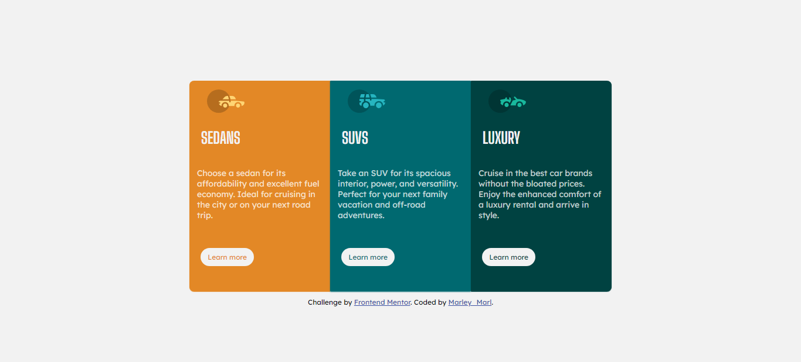

# Frontend Mentor - 3-column preview card component solution

## Table of contents

- [Overview](#overview)
  - [The challenge](#the-challenge)
  - [Screenshot](#screenshot)
  - [Links](#links)
- [My process](#my-process)
  - [Built with](#built-with)
  - [What I learned](#what-i-learned)
- [Author](#author)

## Overview

This is a solution to the [3-column preview card component challenge on Frontend Mentor](https://www.frontendmentor.io/challenges/3column-preview-card-component-pH92eAR2-).

### The challenge

Users should be able to:

- View the optimal layout depending on their device's screen size
- See hover states for interactive elements

### Screenshot



### Links

- Solution URL: [Add solution URL here](https://your-solution-url.com)
- Live Site URL: [Add live site URL here](https://your-live-site-url.com)

## My process

I used
Semantic HTML5,
CSS3 Flexbox,
CSS3 Variables and
Pseudo-selectors to build the 3 column preview card component.

### Built with

- Semantic HTML5 markup
- CSS
- Flexbox

### What I learned

In this challenge I learnt how to use the media rule to set stlying for different media/devices of different sizes.
I have also learnt to use CSS variables to set common color styles for different elements in easy to reach locations and I have also mastered pseudo-selectors like :active, :visited and :hover and the order they follow.

```css
@media (max-width: 600px) {
  #column-container {
    flex-direction: column;
    font-size: 12px;
    padding-top: 27vh;
  }

  @media (min-width: 601px) {
    #column-container {
      flex-direction: row;
    }
  }
}
```

```css
.btn-2:hover {
  background-color: hsl(184, 100%, 22%);
  color: hsl(0, 0%, 95%);
  border: 2px solid hsl(0, 0%, 95%);
  cursor: pointer;
}
```

## Author

- Name - [Marley]
- Frontend Mentor - [@Marley-Semende](https://www.frontendmentor.io/profile/Marley-Semende)
- LinkedIn - [Marley Semende] (https://www.linkedin.com/in/marley-semende-web-dev/)
